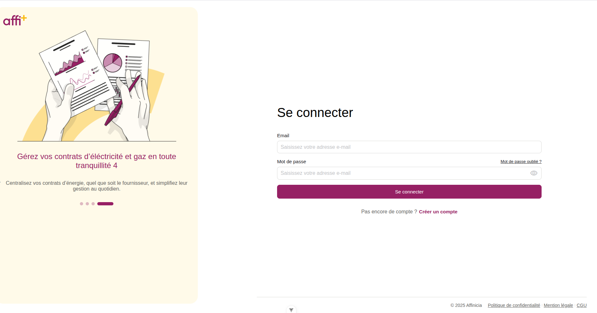
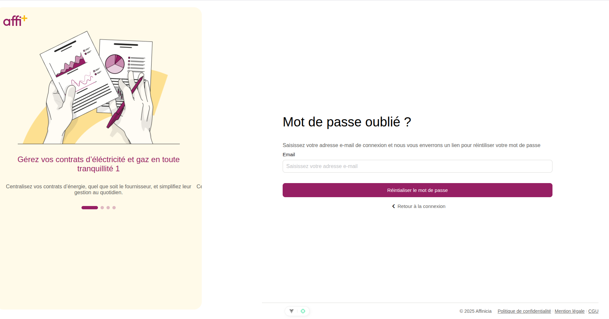
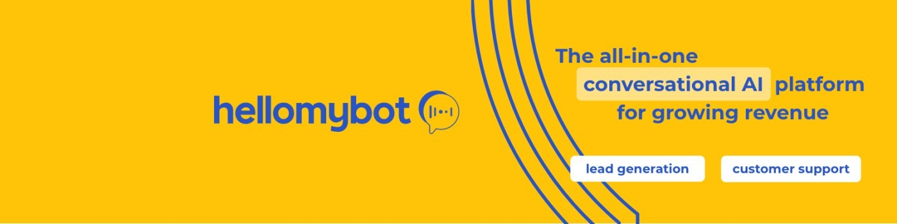
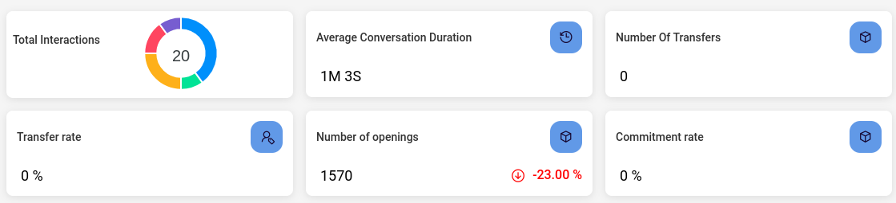
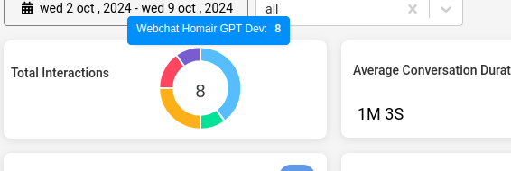
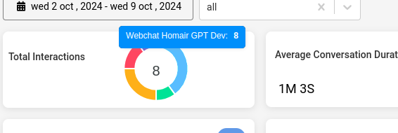
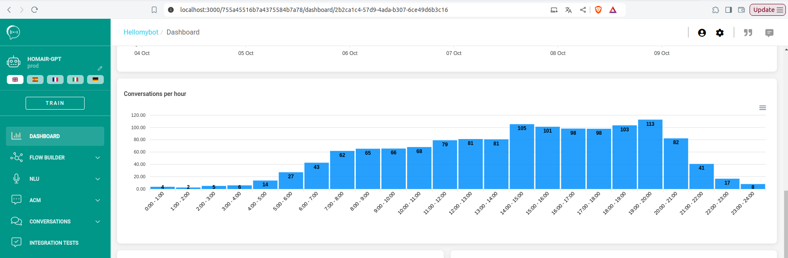
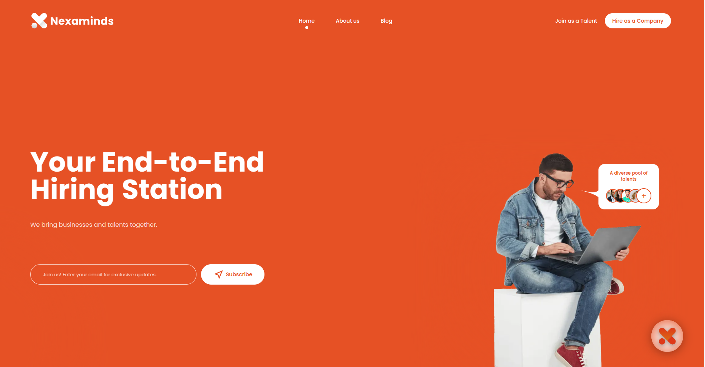
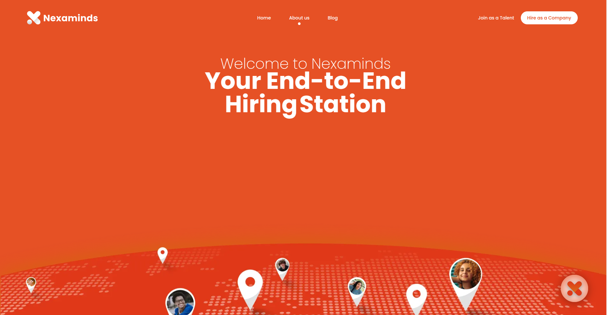
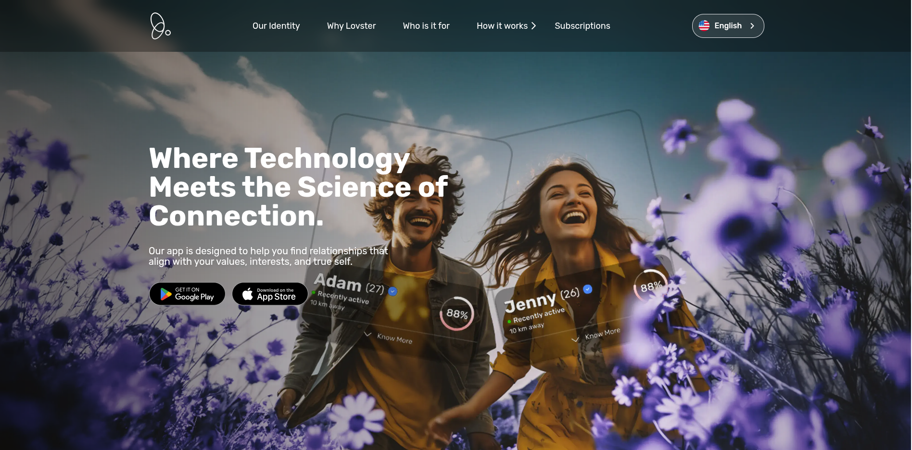

# 👨‍💻 Khaled Mehrez  
**Senior Fullstack Developer | NestJS Specialist | 4 Years XP**

Backend-focused full-stack developer passionate about clean architecture, microservices, and delivering real value through scalable systems. I’ve spent the past 4 years crafting backend services, contributing to both startup growth and enterprise-grade platforms.

---

## 📍 About Me

- 💼 Focused on **backend development** using **NestJS**, **Node.js**, and **MongoDB**
- 🚀 Comfortable with building **microservices** and deploying to **cloud and CI/CD pipelines**
- 🎯 Strong understanding of **SOLID principles**, **TDD**, and **Agile practices**
- 🛠️ Experienced in cross-functional teams and fast-paced environments

---

## 🧠 Tech Stack

```
**Backend:** NestJS, Node.js, Express, MongoDB, Mongoose, TypeScript, PHP, Laravel, MySQL  
**Frontend:** Next.js, Vue.js, Strapi  
**DevOps / Tools:** Docker, GitLab CI/CD, Swagger, Postman, Redis, BullMQ  
**Others:** NX Monorepo, Firebase Messaging, Agile, TDD, SOLID

```
## 🧭 What I’m Open To

- Backend-focused roles (Node.js/NestJS)
- Remote or hybrid positions
- Freelance contracts
- Technical mentorship or collaboration on open-source
---

## 💼 Work Experience
### 🔴 Affincia (Affitech) – _Senior Fullstack Developer_ 
**Apr 2025 – Present**  
Currently working on **Espace Client**, a web dashboard that allows users to manage their electricity contracts and households.

- Developed and secured the **password reset flow**, including token handling and reset logic using **Laravel**
- Built dashboard views using **Vue.js**, allowing users to manage their **households and contracts**
- Integrated **CM.com Sign API** to support document signing with webhook handling
- Contributed to both backend (Laravel) and frontend (Vue) in a cross-functional dev team


### 🔵 Hello_My_Bot– _Senior Fullstack Developer_  
**Sep 2024 – Mar 2025**

- Built a custom analytics API for chatbot usage using **NestJS + MongoDB**
- Integrated **OpenAI GPT APIs** into chatbot flows
- Connected bots to Google Sheets, Slack with custom automation pipelines
- Created dashboards for bot-specific KPIs

---

### 🟠 Nexaminds – _Senior Fullstack Developer_  
**May 2023 – Aug 2024**

- Contributed to backend in **NestJS (monorepo)** for talent acquisition platform  
- Participated in architecture and sprint planning with a remote Agile team  
- Maintained performance and scalability through efficient Mongo queries

---

### 🩷 ZSZ Developer (Lovester Project) – _Fullstack Developer_  
**Apr 2021 – May 2023**

- Built multiple microservices: **Notifications**, **Personality Assessment**, **Media**
- Helped build frontend with **Vue.js**, contributed to **Next.js** and **Strapi** for CMS
- Implemented caching and background processing using **Redis** and **Bull**

---

## 🌱 Side Projects

_Add these once we upload screenshots or links:_

- 🔧 **Active Citizen Website** – Volunteering project under ONTJ + British Council
- 📊 **Personal Stats Dashboard** – [coming soon]

---

## 📷 Screenshots

> _You can paste images here using GitHub issues or direct uploads. For now, we’ll leave placeholders._

### 🔴 Affincia (Affitech)



### 🔵 Hello_My_bot





 

### 🟠 Nexaminds




### 🩷  ZSZ Developer (Lovester Project)
## Landing Website


## Web App


---

## 🔗 Let's Connect

- 📫 Email: [khaled.mehrez.m@gmail.com](mailto:khaled.mehrez.m@gmail.com)  
- 💼 LinkedIn: [linkedin.com/in/khaled-mehrez](https://www.linkedin.com/in/khaled-mehrez)  
- 🛠️ GitHub: [github.com/khaledmehrez](https://github.com/khaledmehrez)

---

_“Let things flow naturally forward in whatever way they like”_
